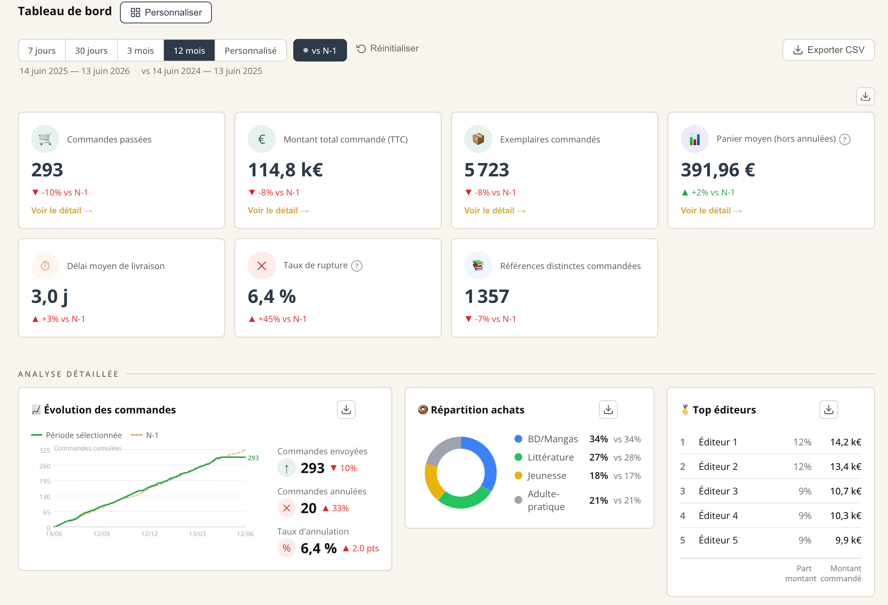
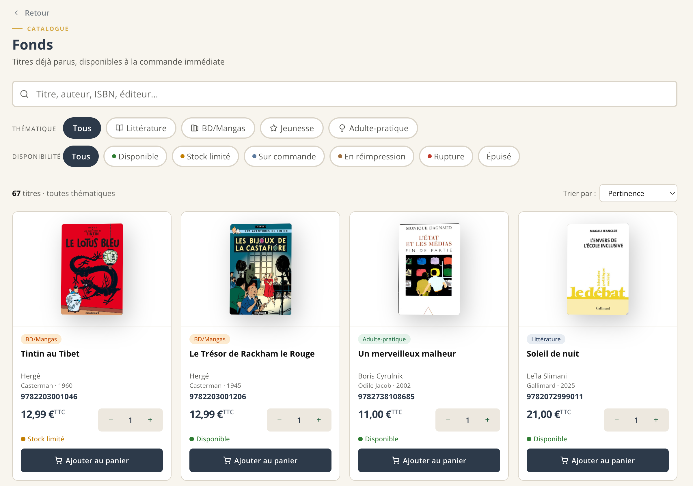
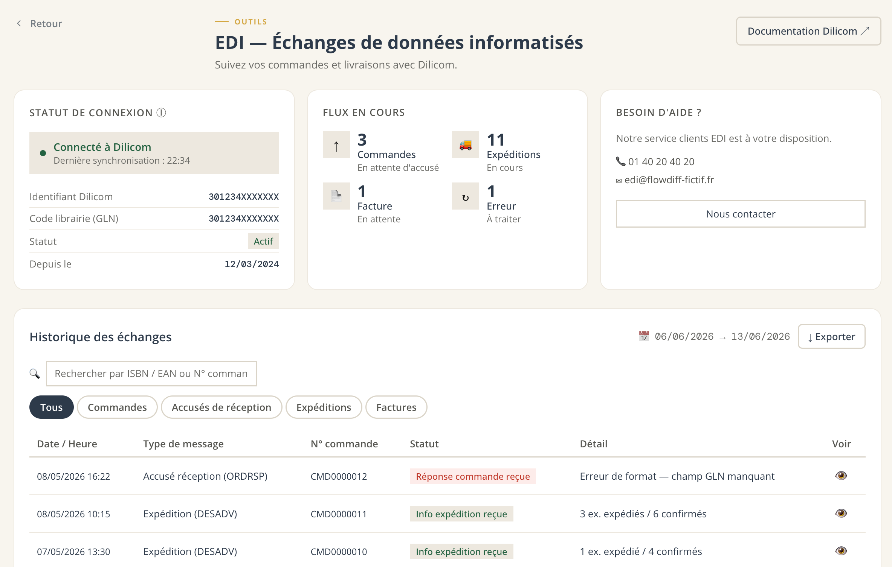

# 📚 FlowDiff — Plateforme B2B de commande de livres pour libraires

> **Application de démonstration conçue et construite de bout en bout en pilotant l'IA (Claude Code).**
> Un cas concret de *Product Owner augmenté par l'IA* : de la vision produit et des règles métier jusqu'au produit livré, testé et déployé.

<p>
  
  
  
  
  
  
</p>

**🔗 Démo live :** https://flowdiff-omega.vercel.app/login
**🔑 Connexion :** les identifiants de démo sont **déjà pré-remplis** — il suffit de cliquer sur **Se connecter**.



---

## 🎯 Le produit

Les libraires commandent leurs livres à leurs diffuseurs via des outils souvent vieillissants (EDI Dilicom, bons de commande, tableurs). **FlowDiff** est une application **B2B exclusive aux libraires** qui réunit en un seul endroit :

- la **commande** de fonds, nouveautés, top ventes et sélections éditoriales,
- un **tableau de bord** d'activité (volumes, montants, top éditeurs, taux de rupture…),
- la **transmission EDI** des commandes au format EDIFACT (Dilicom),
- la **facturation** et l'historique, avec remises personnalisées par librairie.

> 💡 L'enjeu n'était pas « faire une app » mais **modéliser un domaine métier réel** (chaîne du livre, remises, TVA, EDI) et le traduire en un produit utilisable.

---

## ✨ Fonctionnalités livrées

| Domaine | Ce qui est implémenté |
|---|---|
| **Catalogue** | Fonds, Nouveautés, À paraître, Top ventes, Sélections · recherche + filtres par univers · fiches produit · **vraies couvertures** (Google Books / Open Library, stockées en Supabase) |
| **Commande** | Panier avec **remises auto par thématique**, calcul HT / remise / TVA 5,5 % / TTC, références de commande, validation |
| **EDI EDIFACT** | Génération de messages **ORDERS** et **ORDRSP** conformes (UNA/UNB, BGM, segments IMD/PIA/RFF/CNT…), suivi des flux, ACK/DESADV |
| **Tableau de bord** | KPIs, courbes d'évolution, répartition par univers, top éditeurs, comparaison N-1, **exports CSV** par section, personnalisation des cartes (drag & drop) |
| **Facturation** | Factures PDF générées à la volée, paiement (CB/virement), historique |
| **Compte & historique** | Profil librairie, remise & adresse, historique des commandes + duplication 1 clic |
| **Onboarding** | Tour guidé (Driver.js) + infobulles métier |
| **UX** | Responsive **360 px → 1400 px**, design system maison, accessibilité (touch ≥ 44 px, contrastes WCAG AA) |

---

## 🧠 Règles métier modélisées *(le cœur du travail produit)*

- **À paraître non commandable** — consultation catalogue uniquement, commande via représentant.
- **Remises personnalisées** par librairie et par thématique, appliquées automatiquement.
- **TVA livre à 5,5 %** — chaîne de prix cohérente : prix public **HT** (donnée source) → TTC → prix net après remise.
- **EDI Dilicom** — un diffuseur unique, GLN, références de commande, structure EDIFACT réelle.
- **Isolation des données par `codeClient`** — panier et historique partagés au sein d'une librairie, jamais entre librairies.
- **B2B exclusif** — inscription contrôlée (code client + email professionnel).

---

## 🤖 Construit en pilotant l'IA

Ce projet a été **spécifié, développé, revu et testé en orchestrant Claude Code** — et c'est volontaire : il illustre la posture d'un **Product Owner qui livre, pas seulement qui rédige des tickets**.

Concrètement, mon rôle sur ce produit :

- **Discovery & cadrage** — définition du domaine, des personas (libraires), des règles métier et du périmètre.
- **Spécification exécutable** — découpage en phases, critères d'acceptation, charte graphique et design system.
- **Pilotage de l'IA** — rédaction de prompts précis, décomposition des tâches, revue de code, arbitrages techniques (stack, structure de données, sécurité).
- **Qualité** — TypeScript strict, tests Vitest, vérification systématique avant de considérer une tâche « terminée ».

> 🎙️ *La compétence démontrée : transformer une intention produit en logiciel fonctionnel en utilisant l'IA comme force de réalisation — du métier au déployé.*

---

## 🛠️ Stack technique

- **Vite 5 + React 18** — SPA, **React Router v6**
- **TypeScript** (mode strict)
- **Styled-components v6** — design system & thème centralisé (`src/lib/theme.ts`)
- **Supabase** — catalogue & couvertures
- **Zod** — validation de toutes les entrées
- **bcryptjs** — hachage des mots de passe (auth mock)
- **Vitest** — tests unitaires (logique métier : calcul des totaux, commandabilité…)
- **Vercel** — déploiement continu

---

## ▶️ Tester en 30 secondes

**En ligne :** ouvre la démo → les identifiants sont déjà pré-remplis → clique sur *Se connecter*.

**En local :**

```bash
npm install
npm run dev      # http://localhost:5173
```

```bash
npm run test     # lance la suite Vitest
npm run build    # build de production (tsc + vite)
```

---

## 📸 Captures

| Catalogue | EDI EDIFACT |
|---|---|
|  |  |

---

## 📌 Périmètre & limites (assumés)

C'est une **application de démonstration** :

- **Données fictives** (livres, librairies, commandes) à des fins pédagogiques.
- **Authentification simplifiée** (mock JWT en `localStorage`) — pas destinée à la production.
- Certaines sections sont **en cours** et affichées comme telles (ex. *Mon office* → « Bientôt disponible »).

Ces choix sont délibérés : l'objectif est de démontrer la **conception produit, la modélisation métier et la capacité à livrer**, pas de mettre une app en production.

---

## 👤 À propos

Projet réalisé par un **Product Owner spécialisé IA**, pour illustrer une approche *AI Product Builder* : concevoir et livrer un produit complet en pilotant l'intelligence artificielle.

📬 *N'hésitez pas à me contacter pour échanger sur la démarche produit ou le pilotage de l'IA.*
